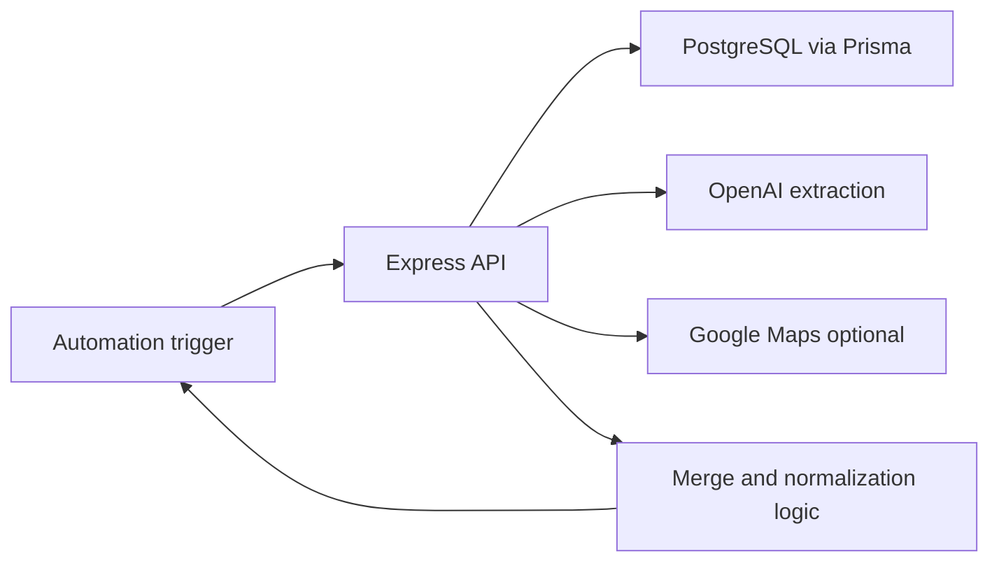
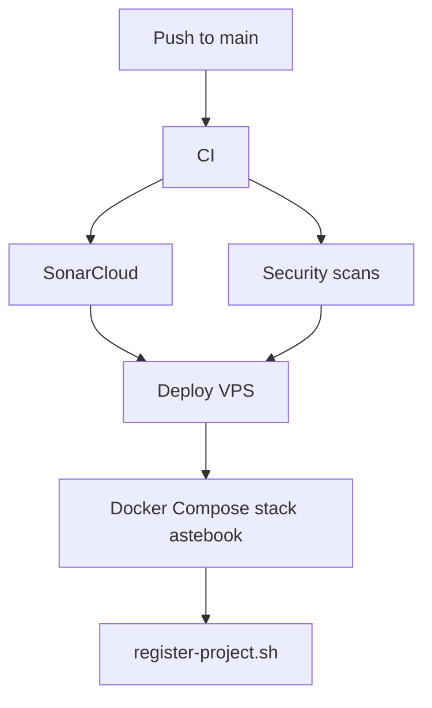

# Architecture

Astebook uses a minimal frontend/backend split.

## Components

- `backend/server.js`: HTTP API, upload handling, orchestration and response formatting.
- `backend/lib/app_config.js`: first-admin bootstrap plus DB-backed runtime settings in production.
- `backend/lib/db.js`: Prisma client for PostgreSQL-backed state.
- `backend/lib/processing_log.js`: Prisma-backed processing event and step store.
- `backend/lib/ai.js`: AI extraction prompts and provider integration.
- `backend/lib/pdf.js`: PDF parsing support.
- `backend/lib/merge_json.js`: domain merge rules.
- `backend/scrapers/`: supporting extraction scripts.
- `backend/tests/`: backend/API tests.
- `frontend/admin`: internal processing UI served by the backend under `/admin`.

## Deployment Flow

## Current Intentional Deviations

- No `/apps` or `/packages` layer yet because the project is still one deployable service.
- Extraction feedback still uses JSONL while processing events, mailbox listing, runtime settings and related operational tables are PostgreSQL/Prisma-backed.
- The frontend is static admin UI, not a separate SPA build pipeline.

These deviations are recorded in `docs/adr/ADR-001-compact-node-service.md`.
