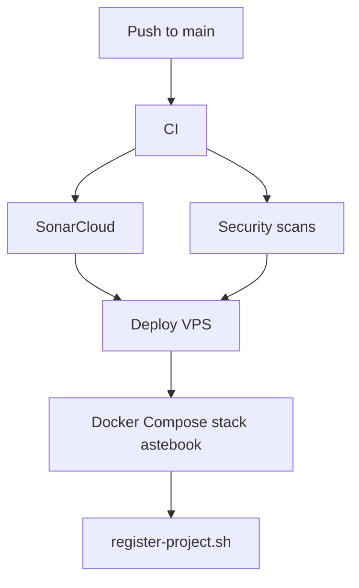

# Architecture

Astebook currently uses a compact modular backend layout.

## Components

- `server.js`: HTTP API, upload handling, orchestration and response formatting.
- `public/admin`: internal processing UI.
- `lib/processing_log.js`: JSONL runtime log for received and processed events.
- `lib/ai.js`: AI extraction prompts and provider integration.
- `lib/pdf.js`: PDF parsing support.
- `lib/merge_json.js`: domain merge rules.
- `scrapers/`: supporting extraction scripts.

## Deployment Flow

## Current Intentional Deviations

- No `/apps/backend` split yet because the service is a single compact backend.
- No PostgreSQL/Prisma yet because the current workflow is stateless.
- No frontend app yet.

These deviations are recorded in `docs/adr/ADR-001-compact-node-service.md`.
