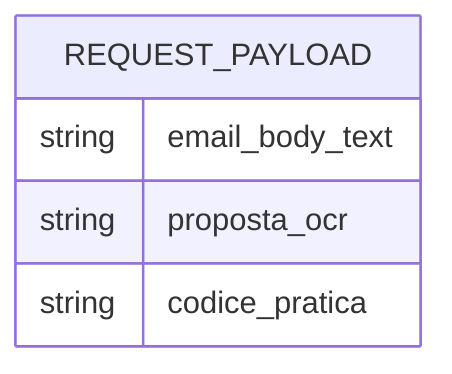

# Database Schema

Astebook currently has no application database.

The current workflow is stateless: request data is processed in memory and returned to the caller.

If persistence is introduced, schema changes must include:

- Prisma migration.
- Updated ERD.
- Updated `docs/DB_SCHEMA.md`.
- ADR when the persistence model affects architecture.

## Placeholder ERD

