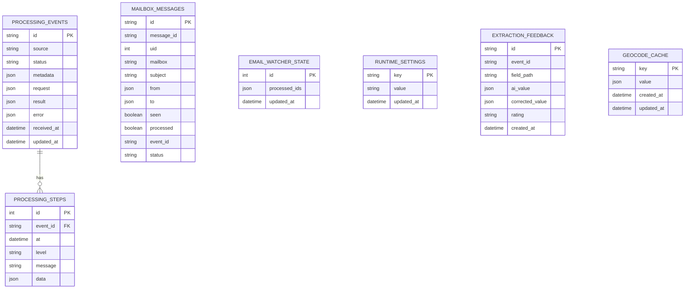

# Database Schema

Astebook uses PostgreSQL with Prisma migrations.

Runtime deployment is managed by `docker-compose.yml`:

- `db`: PostgreSQL 17 with persistent data in Docker named volume `postgres_data_v17`.
- `app`: runs `prisma migrate deploy` before starting the Node server.

The initial database prepares durable tables for operational state. Mailbox listing is DB-backed in production: the IMAP watcher inserts or updates `mailbox_messages`, and the admin listing reads that table instead of opening a live IMAP listing.

## Connection

Default Docker connection:

```text
postgresql://astebook:astebook@db:5432/astebook?schema=public
```

CI uses the same credentials against the GitHub Actions PostgreSQL service on `localhost`.

## Prisma

- Schema: `prisma/schema.prisma`
- Migrations: `prisma/migrations`
- Apply migrations: `npm run db:migrate`
- Generate client: `npm run db:generate`

## Tables



## Migration Policy

Schema changes require:

- a Prisma migration;
- an update to this file;
- a CI run that applies migrations against PostgreSQL;
- a deploy through the standard pipeline so `prisma migrate deploy` runs before the app starts.
